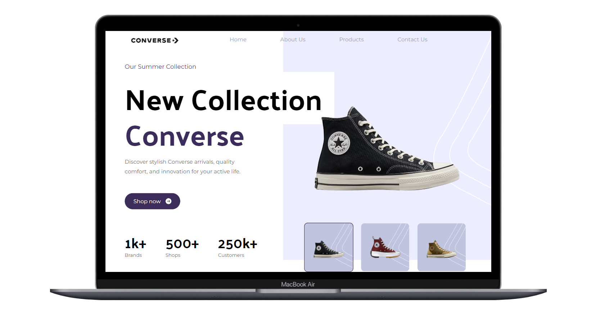

# Landing page for the Converse store built using React, Vite, Typescript and Tailwind




## Getting Started

1. Clone the repository:

   ```git clone https://github.com/Peannut/converse.git```

2. Navigate to the project

   ```cd converse```
   
4. Install dependencies

   ```npm install```
   
6. Run the development server

   ```npm run dev```

   Open ```http://localhost:3005``` in your browser to view the app.


## Technologies Used

- Vite
- React
- Javascript
- Tailwind CSS


## live link
	converse-alpha.vercel.app